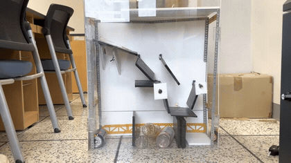

[English](README.md) | [한국어](README.ko.md)

# 아두이노를 활용한 자동화 분리수거 시스템

아두이노 우노 3대로 구현한 3단계 자동 분리수거 시제품입니다. 투입된 재활용
쓰레기를 **금속(캔) / 무거운 비금속(유리) / 가벼운 비금속(플라스틱)** 으로 자동
분류합니다. 교내 나노데이 경진대회(2022년 11월 28일) 팀 출품작입니다.

<p align="center">
  
  
</p>

<p align="center">
  <a href="https://www.youtube.com/watch?v=H_4M0ptQ-k8">
    
  </a>
  <br>
  <em>▶ <a href="https://www.youtube.com/watch?v=H_4M0ptQ-k8">유튜브에서 전체 데모 영상(38초) 보기</a></em>
</p>

## 시스템 구성 — 3단계 분류 파이프라인

```
투입 → [1단계] 컨베이어 벨트 → [2단계] 금속 분리 게이트 → [3단계] 무게 분류 → 분리함 3개
```

| 단계 | 역할 | 센서 | 액추에이터 | 보드 |
|---|---|---|---|---|
| 1. 컨베이어 | 물체를 하나씩 다음 단계로 이송 | HC-SR04 초음파 ×2 | 연속회전 서보 ×1 | Uno #1 |
| 2. 금속 분리 | 금속(캔)과 비금속 분기 | 정전용량 근접센서 ×1, HC-SR04 ×1* | 서보 ×2 (투입문·분기) | Uno #2 |
| 3. 무게 분류 | 무게로 유리/플라스틱 구분 | HX711 + 로드셀 | 서보 ×2 (회전·배출) | Uno #3 |

\* 2단계 초음파 게이트는 초안 설계에 있었으나 구조 간섭으로 최종 기체에서는 제외했습니다.

각 단계 동작 (당시 기록 기준):

- **1단계**: 초음파 2개가 모두 기준 거리 안에서 물체를 감지하면 벨트를 구동해
  물체를 하나씩 떨어뜨립니다. 여러 개를 한 번에 올려도 직렬화되도록 한 설계입니다.
- **2단계**: 투입구 접근 시 문이 열리고, 정전용량 근접센서가 물체를 감지해 분기
  서보가 경로를 바꿉니다.
- **3단계**: 로드셀 측정값이 1.0 초과면 무거움(유리) 칸, 0.5 초과 1.0 이하이면
  가벼움(플라스틱) 칸으로 회전·배출 서보가 분류합니다.

> **왜 정전용량 근접센서인가?** 커패시터의 한쪽 전극처럼 동작합니다. 센서의 전기장
> 안으로 물체가 들어오면 그 물체의 유전율(비전도체) 또는 전기전도성(금속·물)에 의해
> 정전용량이 변하고, 이 변화가 내부 발진 회로를 흔들어 비접촉 on/off 출력으로
> 바뀝니다. 금속만 감지하는 유도형과 달리 전도성·고유전율 물질에 모두 반응하며, 이
> 제작물에서는 금속 캔과 물(액체)은 감지하고 빈 플라스틱·투명/불투명 물체는
> 무시하도록 동작했습니다.

세 보드는 서로 통신하지 않고 독립 동작하며, 단계 간 타이밍은 지연(delay)으로
맞췄습니다. 이 선택의 비용과 대안은 [docs/code-review.ko.md](docs/code-review.ko.md)에
정리했습니다.

## 펌웨어

| 폴더 | 설명 |
|---|---|
| [`firmware/original/`](firmware/original) | 대회 당시 코드 기록 (그대로 보존) |
| [`firmware/revised/`](firmware/revised) | 로직은 유지하고 컴파일 가능하게 정리한 버전 |

original 보존 상태:

- `stage1_conveyor` — 당시 제출본, 컴파일 가능
- `stage2_metal_sorter` — 본인 작성 초안. 변수명 불일치로 컴파일 불가 (대회에서
  동작한 최종본은 팀원이 완성, 기록 유실)
- `stage3_weight_sorter` — 기록 원문이 끊겨 끝부분(닫는 중괄호) 유실

revised는 동작 로직을 그대로 두고 컴파일 오류 수정, `pulseIn` 타임아웃, 상수화,
주석 보강, HC-SR04 트리거 절차 보완만 적용했습니다(변경 내역은 각 파일 상단 주석 참고). 3단계는 HX711
라이브러리(bogde)가 필요합니다. 세 스케치 모두 arduino-cli(arduino:avr:uno)로
컴파일을 확인했습니다.

## 팀

Kyung-Bo Kim, Dong-Gi Lee, Yun-Jeong Jang, Yeeun Kwak 팀 프로젝트입니다.

## 한계와 개선 방향

1. **종이 분류 불가** — 분광 방식 재질 센서는 고가라 제외. 이미지 센서 + CNN이
   현실적 대안 (ESP32-CAM + TensorFlow Lite로 저비용 구현 가능)
2. **형상 불균일** — 한 가지 형상만 안정 통과하는 구조. 투입 전 압축 기구로 형상
   정규화 필요
3. **복합 재질** — 상단만 금속인 플라스틱 캔은 낙하 자세에 따라 분류가 갈림
4. **내용물 있는 용기** — 음료가 남은 페트병은 무게 때문에 유리로 오분류
5. **대형 페트병** — 단일 크기 기준 구조라 미지원. 크기별 투입 경로로 확장 가능
6. **동시 다중 투입** — 컨베이어로 직렬화하는 설계였으나 낙하 타이밍 조정 미완

## 문서

- [회고 — 심사 Q&A와 트러블슈팅](docs/retrospective.ko.md)
- [코드 리뷰 — 기술 분석과 개선 제안](docs/code-review.ko.md)
- [참고 자료 모음](docs/references.ko.md)

## 라이선스

[MIT License](LICENSE) — © 2022 Kyung-Bo Kim, Dong-Gi Lee, Yun-Jeong Jang, Yeeun Kwak
