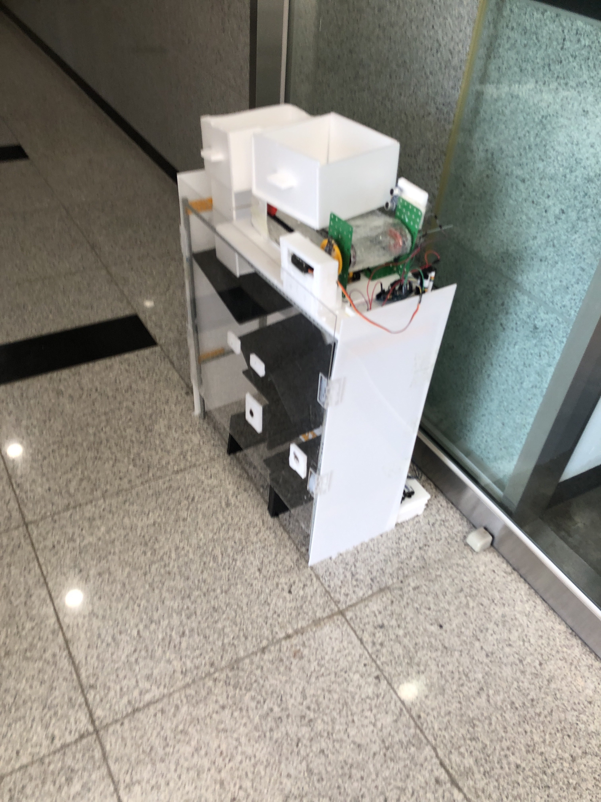
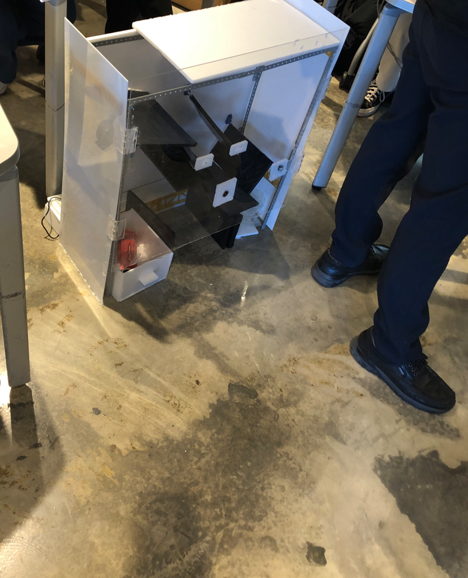

[English](README.md) | [한국어](README.ko.md)

# Arduino-Based Automated Recycling Sorter

A three-stage automated recycling-sorting prototype built with three Arduino Unos.
It sorts incoming recyclables into **metal (cans) / heavy non-metal (glass) / light
non-metal (plastic)**. Built as a team entry for our university's Nano Day
competition (June 28, 2022).

<p align="center">
  
  
</p>

## System Overview — Three-Stage Sorting Pipeline

```
Input → [Stage 1] Conveyor belt → [Stage 2] Metal separation gate → [Stage 3] Weight-based sorting → 3 bins
```

| Stage | Role | Sensors | Actuators | Board |
|---|---|---|---|---|
| 1. Conveyor | Feeds items one at a time to the next stage | 2× HC-SR04 ultrasonic | 1× continuous-rotation servo | Uno #1 |
| 2. Metal separation | Splits metal (cans) from non-metal | 1× inductive proximity sensor, 1× HC-SR04* | 2× servos (inlet door, diverter) | Uno #2 |
| 3. Weight sorting | Separates glass from plastic by weight | HX711 + load cell | 2× servos (rotate, dump) | Uno #3 |

\* The Stage 2 ultrasonic gate was part of the initial design but was dropped from the final build due to mechanical interference.

How each stage works (as recorded at the time):

- **Stage 1**: When both ultrasonic sensors detect an object within their thresholds,
  the belt runs and drops items one at a time — designed so that several items placed
  at once still get serialized.
- **Stage 2**: The inlet door opens when an object approaches, and the inductive
  proximity sensor detects metal via eddy currents; a diverter servo switches the path.
- **Stage 3**: A load-cell reading above 1.0 sends the item to the heavy (glass) bin;
  a reading above 0.5 and up to 1.0 sends it to the light (plastic) bin.

The three boards run independently with no communication between them; inter-stage
timing relies on delays. The cost of that choice, and the alternatives, are covered
in [docs/code-review.md](docs/code-review.md).

## Firmware

| Folder | Description |
|---|---|
| [`firmware/original/`](firmware/original) | Code as written at the time (preserved verbatim, Korean comments) |
| [`firmware/revised/`](firmware/revised) | Cleaned-up version — same logic, made compilable |

Preservation status of the originals:

- `stage1_conveyor` — as submitted; compiles
- `stage2_metal_sorter` — my draft; does not compile due to identifier mismatches
  (the final working version was completed by a teammate and its record is lost)
- `stage3_weight_sorter` — the source record was cut off, losing the closing brace

The revised sketches keep the original behavior and only apply compile fixes,
`pulseIn` timeouts, named constants, comment improvements, and HC-SR04
trigger-procedure corrections (see each file's header for the change list). Stage 3
requires the HX711 library (bogde). All three sketches are compile-verified with
arduino-cli (arduino:avr:uno).

## My Role (Team Project)

- **Me**: research, system design, firmware for all three Unos, structure building,
  sourcing materials, presentation slides (weeks 1, 2, 4–6), presentations (weeks 1–7
  and the Nano Day competition demo)
- **Teammates**: sourcing materials, collecting average-weight measurements, structure
  building, completing the final Stage 2 firmware, poster design

## Limitations and Future Work

1. **Cannot classify paper** — spectroscopic material sensors were too expensive; an
   image sensor + CNN is the realistic alternative (cheap to build with ESP32-CAM +
   TensorFlow Lite)
2. **Shape variance** — the structure reliably handles only one shape; a compactor at
   the inlet would normalize shapes
3. **Mixed materials** — plastic cans with metal tops sort randomly depending on how
   they fall
4. **Containers with leftover liquid** — misclassified as glass due to weight
5. **Large PET bottles** — unsupported by the single-size design; per-size inlet paths
   could extend it
6. **Multiple simultaneous inputs** — the conveyor was designed to serialize them, but
   drop-timing tuning was unfinished

## Documents

- [Retrospective — judges' Q&A and troubleshooting](docs/retrospective.md)
- [Code review — technical analysis and improvement proposals](docs/code-review.md)
- [References](docs/references.md)
